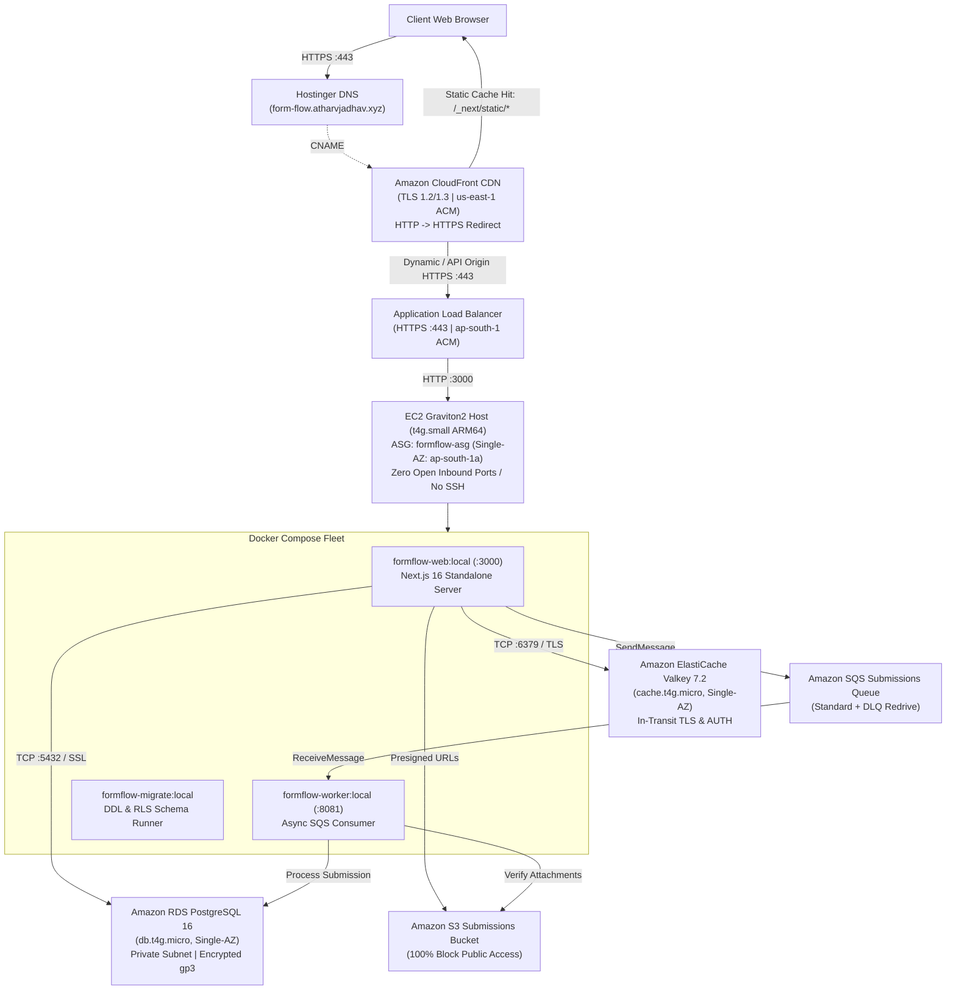

# FormFlow

Multi-tenant form builder and submissions platform built with Next.js 16, Drizzle ORM, PostgreSQL with enforced Row-Level Security (RLS), Amazon ElastiCache Valkey, Amazon SQS, and Amazon S3. Deployed to AWS via Terraform and automated with GitHub Actions CI/CD.

Live Production URL: **[https://form-flow.atharvjadhav.xyz](https://form-flow.atharvjadhav.xyz)**

> [!NOTE]
> **Project Scope & Architecture Invariant**: FormFlow is a resume/portfolio DevOps project demonstrating production-grade cloud architecture, Infrastructure as Code, least-privilege IAM security, and CI/CD automation. To maintain minimal, predictable cloud costs (~$35–$45/month total), compute (`t4g.small`), relational database (`db.t4g.micro`), and distributed cache (`cache.t4g.micro`) are **intentionally deployed in a Single Availability Zone (`ap-south-1a`)** with zero NAT Gateways. Multi-AZ compute and enterprise clustering are intentionally omitted.

---

## 1. System Architecture



---

## 2. Key Architectural Features

- **Global Edge Caching**: AWS CloudFront fronts the Application Load Balancer with `PriceClass_100`, caching Next.js immutable bundles (`/_next/static/*`) and optimized images while dynamically proxying API, authentication, and SSR routes without caching.
- **Dual-Region SSL/TLS Termination**: An ACM certificate in `us-east-1` terminates TLS at CloudFront edge nodes; a separate ACM certificate in `ap-south-1` terminates TLS at the ALB origin. DNS is managed entirely via Hostinger (zero Route 53 fees).
- **Multi-Tenant Row-Level Security (RLS)**: Enforced at the Postgres engine level. Application queries execute through the non-privileged `formflow_app` role using transaction-scoped `withOrg(orgId, fn)` sessions (`SET LOCAL app.current_org_id`). Connections without an organization context fail closed.
- **Zero-Inbound-SSH Security**: EC2 security groups expose zero administrative ports. System management and debugging are conducted entirely via AWS Systems Manager Session Manager (`aws ssm start-session`).
- **Secrets Management via SSM Parameter Store**: Zero plaintext secrets in Git, Dockerfiles, or Launch Templates. Parameters are dynamically retrieved at runtime and injected into `/opt/formflow/.env` with strict `0600` permissions.
- **Passwordless GitHub Actions CI/CD**: Pushing to `main` triggers automated TypeScript typechecking, builds, OpenID Connect (OIDC) authentication with AWS IAM (zero long-lived access keys), and remote deployment execution via AWS Systems Manager Run Command.

---

## 3. Technology Stack

| Layer | Technology | Purpose |
|---|---|---|
| **Frontend & API** | Next.js 16 (App Router), React 19, Tailwind CSS | Multi-tenant form builder, public runtime, admin dashboard |
| **Authentication** | Clerk | Organization management, session authentication, webhooks |
| **Database** | PostgreSQL 16 (Amazon RDS), Drizzle ORM | Relational schema with forced multi-tenant Row-Level Security |
| **Distributed Cache** | Valkey 7.2 (Amazon ElastiCache) | Shared rate limiting, session synchronization, form metadata caching |
| **Storage** | Amazon S3 | Secure private file storage with presigned client upload/download URLs |
| **Messaging** | Amazon SQS + DLQ | Decoupled asynchronous background submission processing |
| **Infrastructure as Code**| Terraform (AWS Provider `~> 5.0`) | Complete IaC source of truth across networking, compute, and data stores |
| **Edge & Compute** | Amazon CloudFront, ALB, Amazon EC2 (Graviton2 ARM64) | Global CDN, reverse proxy, and containerized Docker Compose workloads |
| **Automation** | GitHub Actions + AWS OIDC + AWS SSM | Passwordless CI/CD pipeline and remote deployment orchestration |

---

## 4. Documentation Index

Detailed engineering documentation is organized under the [`docs/`](file:///c:/Users/Nikita%20Jadhav/OneDrive/Desktop/Form-Builder/docs/) directory:

- **[docs/architecture.md](file:///c:/Users/Nikita%20Jadhav/OneDrive/Desktop/Form-Builder/docs/architecture.md)** — Comprehensive AWS cloud architecture, service specifications, Single-AZ cost discipline, Terraform structure, and security isolation model.
- **[docs/deployment.md](file:///c:/Users/Nikita%20Jadhav/OneDrive/Desktop/Form-Builder/docs/deployment.md)** — CI/CD automation workflow, GitHub Actions OIDC federation, SSM Run Command dispatch, native ARM64 compilation, and rollback procedures.
- **[docs/operations.md](file:///c:/Users/Nikita%20Jadhav/OneDrive/Desktop/Form-Builder/docs/operations.md)** — Production operations runbook, health check verification commands, SSM remote shell access, secret rotation, and troubleshooting guides.

---

## 5. Local Development Setup

### Prerequisites
- Node.js `>= 20.x`
- Docker Engine & Docker Compose
- AWS CLI (for production operations)

### 1. Clone & Install Dependencies
```bash
git clone https://github.com/atharvjadhav-dev/FormFlow.git
cd FormFlow
npm install
```

### 2. Configure Environment Variables
```bash
cp .env.example .env.local
# Fill in your development Clerk and local database credentials
```

### 3. Start Local PostgreSQL and Redis
```bash
docker compose up -d postgres redis
```

### 4. Run Migrations & Start Development Server
```bash
npm run db:migrate
npm run dev
```

Visit `http://localhost:3000` to interact with the local development application.
