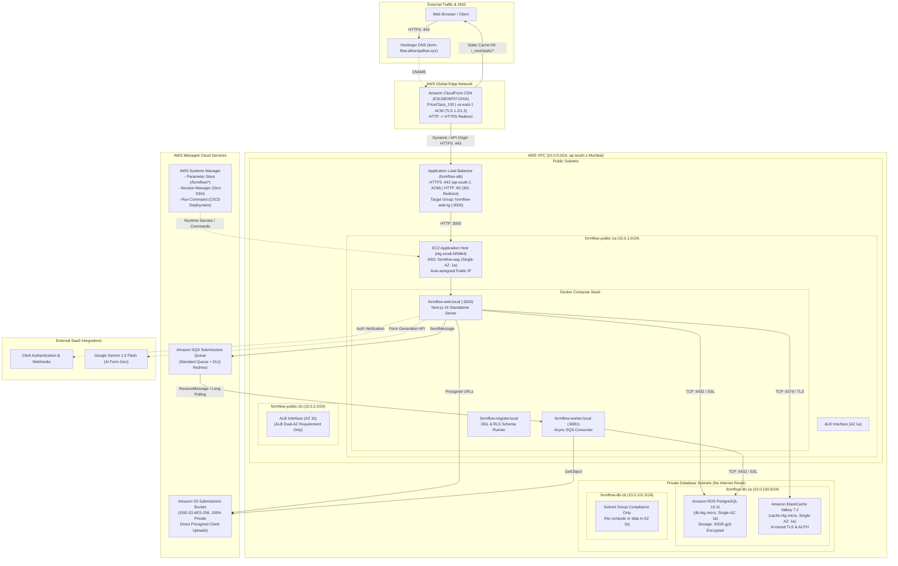

# FormFlow — Production AWS Architecture

> [!NOTE]
> **Project Context & Scope**: FormFlow is a resume/portfolio DevOps project designed to demonstrate production-grade cloud architecture, Infrastructure as Code (Terraform), least-privilege security, and CI/CD automation. To keep cloud costs low and predictable (~$35–$45/month total), compute, relational database, and caching tiers are **intentionally deployed in a Single Availability Zone (`ap-south-1a`)** with zero NAT Gateways. Multi-AZ compute, read replicas, and enterprise clustering are intentionally omitted.

---

## 1. End-to-End System Architecture



---

## 2. AWS Services & Implementation Purpose

| AWS Service | Provisioned Resource | Implementation Purpose & Configuration |
|---|---|---|
| **Amazon CloudFront** | `aws_cloudfront_distribution.main` | Global Content Delivery Network (CDN). Provides edge caching for immutable static assets (`/_next/static/*`, `/_next/image*`), enforces TLS 1.2/1.3 viewer redirects, and passes all dynamic/API/auth requests directly to ALB without caching. |
| **AWS Certificate Manager (ACM)** | `aws_acm_certificate.cert` (`ap-south-1`)<br>`aws_acm_certificate.cloudfront` (`us-east-1`) | Manages SSL/TLS certificates for `form-flow.atharvjadhav.xyz`. Dual-region strategy: `ap-south-1` certificate terminates TLS at the ALB; `us-east-1` certificate terminates TLS at CloudFront edge nodes. DNS validation performed via Hostinger CNAME. |
| **Application Load Balancer (ALB)** | `aws_lb.main` | Public ingress load balancer. Routes port 443 HTTPS traffic to target group `formflow-web-tg` on port 3000 with health checks on `/api/health/live`. Port 80 issues permanent HTTP 301 redirects to HTTPS. |
| **Amazon EC2 & ASG** | `aws_launch_template.app`<br>`aws_autoscaling_group.app` | Single-AZ compute on `t4g.small` (AWS Graviton2 ARM64, 2 vCPU, 2 GiB RAM) running Amazon Linux 2023. Configured with a 2 GiB swapfile to prevent Next.js build-time OOM. Managed entirely via SSM (zero open inbound ports, no SSH). |
| **Amazon RDS PostgreSQL** | `aws_db_instance.postgres` | Primary relational database (`PostgreSQL 16.11`, `db.t4g.micro`, Single-AZ). Strictly private (no public IP), encrypted with AWS KMS (`aws/rds`). Enforces database-level Row-Level Security (RLS) across all multi-tenant tables. |
| **Amazon ElastiCache Valkey** | `aws_elasticache_replication_group.main` | Redis-compatible distributed cache and rate limiter (`Valkey 7.2.6`, `cache.t4g.micro`, Single-AZ). Secured with in-transit TLS encryption and token-based AUTH. Prevents cache desynchronization across container restarts. |
| **Amazon S3** | `aws_s3_bucket.submissions` | Private object storage for form attachments. 100% Block Public Access enabled. Browser uploads and administrative downloads execute strictly via short-lived presigned URLs. Versioning and 90-day lifecycle expiration enabled. |
| **Amazon SQS & DLQ** | `aws_sqs_queue.submissions`<br>`aws_sqs_queue.submissions_dlq` | Asynchronous decoupled job messaging. The web tier publishes submission IDs; background worker containers process them asynchronously. Unprocessable messages are quarantined in the Dead-Letter Queue after 3 delivery attempts. |
| **AWS Systems Manager (SSM)** | Parameter Store (`/formflow/*`)<br>Run Command / Session Manager | Centralized runtime configuration and encrypted secret injection (`.env` mode 600) via EC2 instance profile. Eliminates bastion hosts and hardcoded credentials in Git. Serves as the orchestration transport for CI/CD deployments. |
| **AWS IAM & OIDC** | `aws_iam_openid_connect_provider.github_actions`<br>`aws_iam_role.github_deploy` | Passwordless OpenID Connect federation between GitHub Actions and AWS. Grants temporary, least-privilege credentials scoped to the `main` branch of `atharvjadhav-dev/FormFlow` for SSM deployment dispatch. |

---

## 3. Intentional Architectural Decisions & Cost Discipline

### 3.1 Single-AZ Compute and Data Tiers
- **Compute (`ap-south-1a`)**: Running a single `t4g.small` instance in an Auto Scaling Group (Min: 1, Desired: 1, Max: 2) guarantees predictable compute costs while allowing the ASG to automatically replace an unhealthy host.
- **RDS (`ap-south-1a`)**: Multi-AZ RDS standby instances roughly double database pricing ($16/mo -> $32/mo). FormFlow intentionally deploys Single-AZ with automated daily snapshots and 7-day retention.
- **ElastiCache (`ap-south-1a`)**: Co-locating the Valkey cache node in the exact same Availability Zone as EC2 and RDS delivers sub-millisecond latencies and $0.00 inter-AZ data transfer fees.
- **Secondary Subnet Rationale**:
  - `formflow-public-1b` exists **only** because AWS Application Load Balancers require public subnets across at least two AZs.
  - `formflow-db-1b` exists **only** because RDS DB Subnet Groups enforce coverage across at least two AZs.
  - **No EC2 instances, database nodes, or active workloads run in AZ `1b`**.

### 3.2 Zero NAT Gateways
- AWS managed NAT Gateways cost ~$32.40/month per gateway before data processing fees.
- By placing the single EC2 host in the public subnet (`formflow-public-1a`) with an auto-assigned public IP and strict security group ingress (allowing port 3000 solely from `sg-alb`), outbound requests to AWS APIs (SSM, S3, SQS), Clerk, and Gemini route directly through the free Internet Gateway (`formflow-igw`), saving ~$388/year.
- Database and cache nodes remain completely isolated in private subnets with no route to the Internet Gateway.

### 3.3 Zero Amazon ECR Dependencies
- Rather than cross-compiling ARM64 images locally on development machines (which suffers from slow QEMU emulation) and pushing multi-gigabyte layers over residential broadband to Amazon ECR, images are built natively on the Graviton2 `t4g.small` host via Docker Compose during deployment.
- This eliminates ECR storage fees, ECR public endpoints, and external container registry authorization steps.

---

## 4. Terraform Structure & IaC Organization

Terraform (`>= 1.6.0`, AWS provider `~> 5.0`) serves as the single source of truth for all cloud infrastructure.

```
infra/
├── provider.tf            # AWS providers (default ap-south-1, alias us_east_1 for CloudFront ACM)
├── variables.tf           # Configurable inputs (VPC CIDRs, instance types, domain, GitHub repo)
├── vpc.tf                 # VPC, internet gateway, public/private subnets, and route tables
├── security_groups.tf     # Strict security group chaining (ALB -> EC2 -> RDS / Valkey)
├── iam.tf                 # EC2 IAM role, instance profile, SSM & S3/SQS access policies
├── oidc.tf                # GitHub Actions OIDC provider, deploy role, and trust relationship
├── autoscaling.tf         # Launch template (AL2023 ARM64, user-data) & Auto Scaling Group
├── alb.tf                 # Application Load Balancer, target group, HTTP (80) & HTTPS (443) listeners
├── acm.tf                 # ACM certificates for form-flow.atharvjadhav.xyz (ap-south-1 & us-east-1)
├── cloudfront.tf          # CloudFront CDN, cache policies (Optimized for static, Disabled for dynamic)
├── rds.tf                 # RDS PostgreSQL 16 instance, subnet group, parameter group, random password
├── elasticache.tf         # ElastiCache Valkey replication group, subnet group, random auth token
├── s3.tf                  # Private S3 submissions bucket, encryption, versioning, lifecycle rules
├── sqs.tf                 # Submissions SQS queue, dead-letter queue (DLQ), and redrive policies
└── outputs.tf             # Infrastructure endpoints, resource IDs, ARNs, and DNS records
```

---

## 5. Security & Isolation Model

### 5.1 Defense-in-Depth Network Chaining
```
[ Internet ] ──HTTP/HTTPS──> [ CloudFront CDN ]
                                   │
                               HTTPS :443
                                   ▼
                       [ formflow-alb-sg ] (Ingress: 80, 443 from 0.0.0.0/0)
                                   │
                               TCP :3000
                                   ▼
                       [ formflow-ec2-sg ] (Ingress: 3000 from formflow-alb-sg ONLY)
                                   │
                     ┌─────────────┴─────────────┐
                  TCP :5432                   TCP :6379
                     ▼                           ▼
            [ formflow-rds-sg ]         [ formflow-cache-sg ]
       (Ingress: 5432 from EC2 ONLY) (Ingress: 6379 from EC2 ONLY)
```

1. **Zero Public SSH**: Port 22 is completely omitted from all security groups. Administration is conducted exclusively via AWS SSM Session Manager (`aws ssm start-session`).
2. **Port 3000 Isolation**: The EC2 instance rejects all port 3000 traffic that does not originate from the ALB's security group (`sg-08b5329b7ac3489f6`). Direct access via the EC2 public IP is blocked.
3. **Database & Cache Isolation**: RDS (5432) and Valkey (6379) reside in private subnets with no internet gateway route, accepting TCP connections strictly from the EC2 security group.

### 5.2 Multi-Tenant Database Row-Level Security (RLS)
- Every tenant table (`forms`, `form_versions`, `submissions`, `submission_files`, `audit_logs`, `members`) enforces Postgres Row-Level Security at the database engine level.
- Application queries execute through the non-privileged `formflow_app` role inside transaction-scoped `withOrg(orgId, fn)` blocks using `SET LOCAL app.current_org_id = 'org_...'`.
- Connections with no organization context see zero rows (fails closed). Cross-tenant queries are blocked even if raw SQL omitted a `WHERE` clause.

### 5.3 Secret & Configuration Management
- Zero production secrets are stored in Git, Dockerfiles, or Launch Template user-data.
- Configuration and secrets reside in AWS SSM Parameter Store under `/formflow/production/`.
- During deployment, `scripts/ssm-env-inject.py` queries SSM via the EC2 instance profile and generates `/opt/formflow/.env` with strict `0600` permissions (`rw-------`, root-owned).
- Container images execute as dedicated non-root users (`nextjs` UID 1001, `worker` UID 1001, `migrate` UID 1001).
