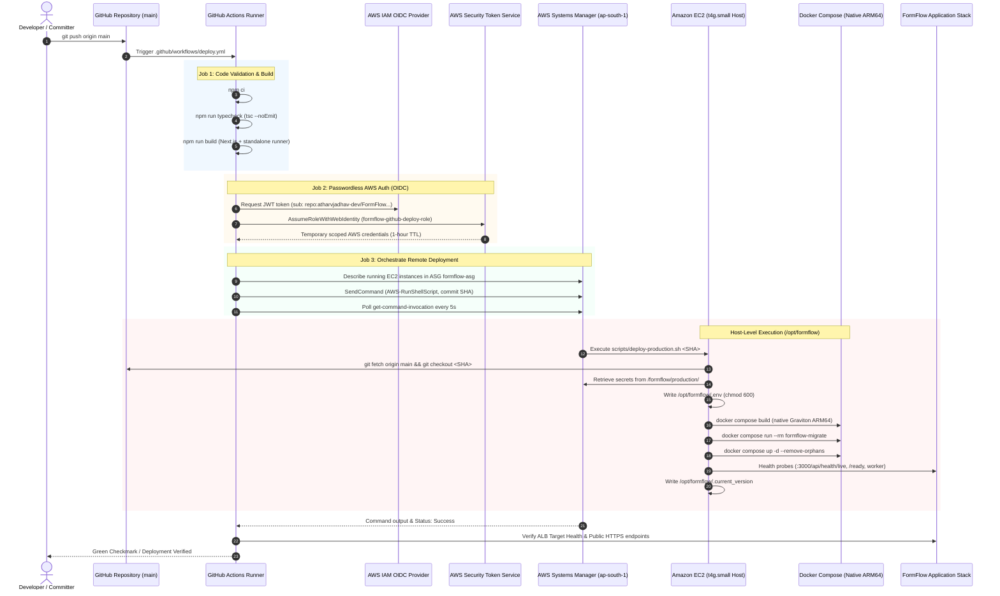

# FormFlow — Production CI/CD & Deployment Guide

> [!NOTE]
> **Architecture Context**: FormFlow uses an automated, passwordless CI/CD pipeline triggered by commits to the `main` branch. Long-lived AWS access keys, SSH keys, bastion hosts, and container registries (ECR) have been completely eliminated in favor of **GitHub Actions OpenID Connect (OIDC)** and **AWS Systems Manager (SSM) Run Command**.

---

## 1. CI/CD Pipeline Architecture



---

## 2. GitHub Actions Workflow Breakdown

The production workflow file is located at [`.github/workflows/deploy.yml`](file:///c:/Users/Nikita%20Jadhav/OneDrive/Desktop/Form-Builder/.github/workflows/deploy.yml).

### 2.1 Job 1: Code Validation & Build Verification (`validate`)
- **Trigger**: Runs on every push to `main` or manual `workflow_dispatch`.
- **Environment**: Ubuntu Latest with Node.js 20.
- **Tasks**:
  1. `npm ci` installs exact lockfile dependencies.
  2. `npm run typecheck` validates strict TypeScript compliance across the entire codebase.
  3. `npm run build` compiles the Next.js standalone application and builds the standalone worker/migrator scripts in `dist/`. Build-time environment variables are supplied with dummy values so builds never require live database connectivity.
- **Fail-Fast**: If validation fails, deployment is automatically blocked.

### 2.2 Job 2: EC2 Deployment via SSM (`deploy`)
- **Dependency**: Executes only upon completion of `validate`.
- **Permissions**:
  ```yaml
  permissions:
    id-token: write
    contents: read
  ```
- **AWS OIDC Authentication**:
  - Uses `aws-actions/configure-aws-credentials@v4`.
  - Assumes `arn:aws:iam::081897152686:role/formflow-github-deploy-role`.
  - Authenticates without storing any secret access keys in GitHub Secrets.
- **Instance Discovery**:
  - Discovers the running instance ID by filtering EC2 instances tagged with `aws:autoscaling:groupName = formflow-asg`.
- **Command Dispatch**:
  - Sends the following execution command to the EC2 host:
    ```bash
    cd /opt/formflow && \
    git fetch origin main && \
    git checkout ${{ github.sha }} && \
    bash /opt/formflow/scripts/deploy-production.sh ${{ github.sha }}
    ```
- **Log Streaming & Polling**:
  - Polls AWS Systems Manager every 5 seconds until execution reaches a terminal status (`Success` or `Failed`).
  - Fetches and prints `StandardOutputContent` and `StandardErrorContent` directly into the GitHub Actions run logs.
- **Post-Deployment Probe**:
  - Verifies that target group `formflow-web-tg` reports the target as `healthy`.
  - Performs an end-to-end HTTPS probe against `https://form-flow.atharvjadhav.xyz/api/health/live` and `/api/health/ready`.

---

## 3. Host-Side Deployment Script (`scripts/deploy-production.sh`)

When invoked by SSM, the deployment script executes the following sequential steps on the EC2 host:

1. **Version Resolution**:
   - Reads `$1` (the target commit SHA) and records the previously running commit from `/opt/formflow/.current_version`.
2. **Git Synchronization**:
   - Configures `safe.directory` for `/opt/formflow`.
   - Runs `git fetch origin main` and checks out the exact commit SHA being deployed.
3. **SSM Secret Injection**:
   - Executes `python3 /opt/formflow/scripts/ssm-env-inject.py --output /opt/formflow/.env --region ap-south-1`.
   - Restricts permissions on `.env` to `chmod 600` (`rw-------`, root only).
4. **Native Container Compilation**:
   - Executes `docker compose -f docker-compose.prod.yml build` natively on the Graviton2 ARM64 architecture, leveraging Docker layer caching.
5. **Database Migration Runner**:
   - Executes `docker compose -f docker-compose.prod.yml run --rm formflow-migrate`.
   - Idempotently applies pending DDL migrations and enforces Postgres Row-Level Security policies.
6. **Container Launch**:
   - Executes `docker compose -f docker-compose.prod.yml up -d --remove-orphans` to recreate running services (`formflow-web`, `formflow-worker`).
7. **Local Probing**:
   - Waits 8 seconds for application initialization.
   - Asserts HTTP 200 on `http://localhost:3000/api/health/live`.
   - Asserts HTTP 200 on `http://localhost:3000/api/health/ready` (validates live RDS and Valkey connections).
   - Asserts HTTP 200 on `http://127.0.0.1:8081/health/live` and `/ready` (validates worker and SQS).
8. **Version File Write**:
   - Writes the new commit SHA and deployment timestamp to `/opt/formflow/.current_version`.

---

## 4. Rollback Procedure

FormFlow uses a deterministic Git-commit-based rollback mechanism.

### Method 1: Git Revert (Recommended)
Because deployments are driven by GitHub Actions, reverting the commit on `main` triggers a complete, clean redeployment of the previous stable commit:

```bash
git revert <BAD_COMMIT_SHA>
git push origin main
```

### Method 2: Instant Manual Rollback via AWS SSM
To roll back without waiting for a Git push, dispatch an SSM command targeting a known good commit SHA:

```bash
# 1. Check current and previous version on EC2
aws ssm send-command \
  --instance-ids "i-0dc760f5cb3864cdd" \
  --document-name "AWS-RunShellScript" \
  --parameters 'commands=["cat /opt/formflow/.current_version"]' \
  --region ap-south-1

# 2. Trigger rollback to a previous commit SHA (e.g., 607e237)
aws ssm send-command \
  --instance-ids "i-0dc760f5cb3864cdd" \
  --document-name "AWS-RunShellScript" \
  --comment "Rollback FormFlow to commit 607e237" \
  --parameters 'commands=["cd /opt/formflow && git fetch origin main && git checkout 607e237 && bash /opt/formflow/scripts/deploy-production.sh 607e237"]' \
  --region ap-south-1
```

---

## 5. Security & Isolation Controls

| Security Control | Implementation Detail |
|---|---|
| **Zero Long-Lived Keys** | No AWS Access Keys are stored in GitHub Secrets. OIDC dynamically exchanges short-lived JWT tokens. |
| **Branch Restriction** | The IAM trust policy strictly enforces `sub: repo:atharvjadhav-dev*/FormFlow*:ref:refs/heads/main`. Feature branches or forks cannot assume the deploy role. |
| **Secret Sanitization** | `scripts/ssm-env-inject.py` logs parameter names and types only. Plaintext secret values are never printed to terminal or CI/CD logs. |
| **No Inbound SSH** | EC2 security groups do not allow port 22. All operations route through the TLS-encrypted AWS Systems Manager agent. |
